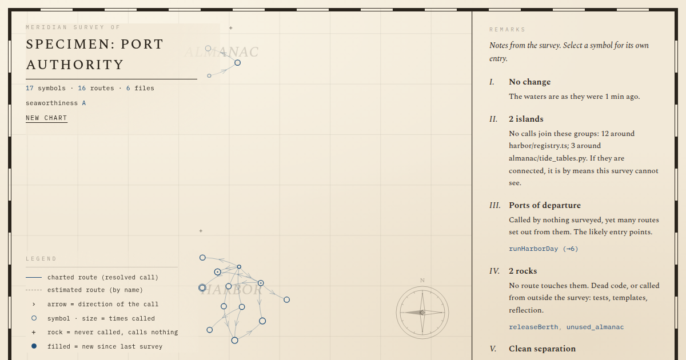

# Meridian Atlas

A navigational chart of your code, rendered in cinematic 3D.

**Use it now: [ricardomaas7.github.io/meridian-atlas](https://ricardomaas7.github.io/meridian-atlas/)** —
no install, no account, no upload.



Open a local folder and Meridian draws its call graph as a 19th-century
nautical chart in **3D WebGL**: every function is a glowing mark, every
resolved call a gold route, with depth separating modules into "seas".
Everything runs in the browser — parsing included — so no source code
ever leaves your machine.

## Features

- **WebGL 3D chart** via Three.js, with cinematic camera orbit, particles, and animated entrance
- **Anime.js animations** for landing, surveying, selection, and UI transitions
- **9 languages**: TypeScript, TSX, JavaScript, Python, Go, Rust, Java, C, C++
- **Static analysis** via [tree-sitter](https://tree-sitter.github.io/) WebAssembly
- **Bilingual UI**: English / Español (selector in top-right corner)
- **Cross-platform desktop** via Tauri 2.0 (Windows, macOS, Linux)
- **MCP server** so AI agents can read your code's structure
- **Zero upload**: everything runs locally

## Run (web)

```sh
npm install
npm run dev
```

Open the printed URL in a Chromium-based browser for the native folder
picker; other browsers get a standard directory upload fallback. Or press
**View specimen** to explore a small bundled example.

## Run (desktop)

The desktop version is built with [Tauri 2.0](https://tauri.app) — a native
window, native menus, and direct filesystem access. About **10 MB** instead
of the ~150 MB Electron would ship.

### Prerequisites

- **Node.js** 18+ and npm
- **Rust** (install via [rustup](https://rustup.rs))
- Platform-specific deps:
  - **Windows**: [Microsoft C++ Build Tools](https://visualstudio.microsoft.com/visual-cpp-build-tools/) + WebView2 (preinstalled on Win10+)
  - **macOS**: Xcode Command Line Tools (`xcode-select --install`)
  - **Linux**: `sudo apt install libwebkit2gtk-4.1-dev libgtk-3-dev libayatana-appindicator3-dev librsvg2-dev libssl-dev`

### Development

```sh
npm install
npm run tauri dev
```

### Production build (creates native installer)

```sh
npm run tauri build
```

## Test

```sh
npm test           # run once
npm run test:watch # watch mode
npm run test:coverage # with coverage
```

## How it works

- **Parsing**: tree-sitter compiled to WebAssembly, running locally.
- **Graph**: declarations become nodes; call expressions are resolved
  first within the file, then by unique global name. Ambiguous matches
  are drawn dashed.
- **Chart**: d3-force layout in 2D, then mapped to 3D with module depth
  (each module is a "sea" at a different z-plane). Rendered in WebGL
  with Three.js, animated with Anime.js.
- **Native (Tauri)**: Rust backend exposes a `scan_directory` command
  using `walkdir` for fast filesystem traversal.

## Architecture

```
src/
  ui/              # React components (App, ChartCanvas 3D, SidePanel)
  graph/           # Chart construction, layout, interpretation, snapshots
  parser/          # tree-sitter queries and language specs
  i18n/            # English/Spanish translations
  native/          # Tauri-native commands
  demo/            # Bundled example survey
src-tauri/         # Rust backend (Tauri 2.0)
mcp/               # MCP server
scripts/           # Build helpers
```

## Native shortcuts (desktop)

- **Ctrl/Cmd + O**: Open folder
- **Ctrl/Cmd + Shift + S**: View specimen
- **Ctrl/Cmd + N**: New chart
- **Ctrl/Cmd + R**: Re-survey current folder
- **Ctrl/Cmd + Q**: Quit
- **F12**: Toggle dev tools (debug build only)

## MCP server

```sh
claude mcp add meridian -- npx -y github:RicardoMaas7/meridian-atlas
```

## Roadmap

- SCIP cross-file resolution
- Symbol search & filter UI
- Export charts as PNG


